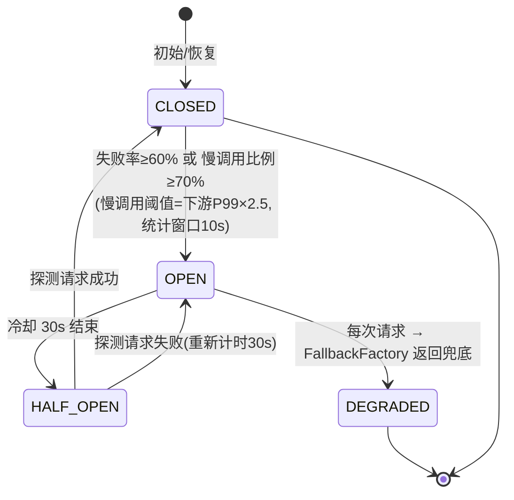

```mermaid
stateDiagram-v2
    [*] --> CLOSED: 初始/恢复
    CLOSED --> OPEN: 失败率≥60% 或 慢调用比例≥70%<br/>(慢调用阈值=下游P99×2.5, 统计窗口10s)
    OPEN --> HALF_OPEN: 冷却 30s 结束
    HALF_OPEN --> CLOSED: 探测请求成功
    HALF_OPEN --> OPEN: 探测请求失败(重新计时30s)
    OPEN --> DEGRADED: 每次请求 → FallbackFactory 返回兜底
    DEGRADED --> [*]
    CLOSED --> [*]
```
